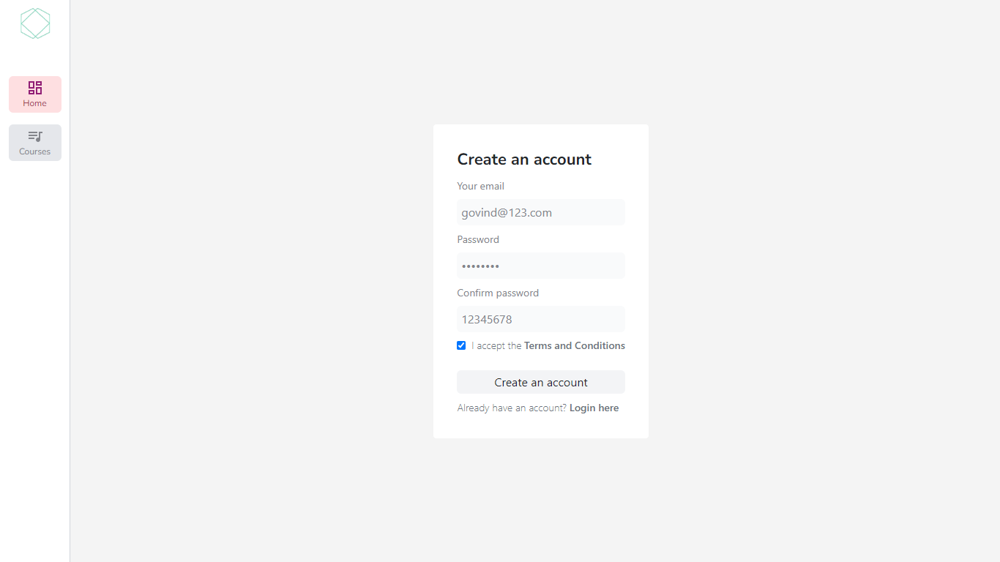
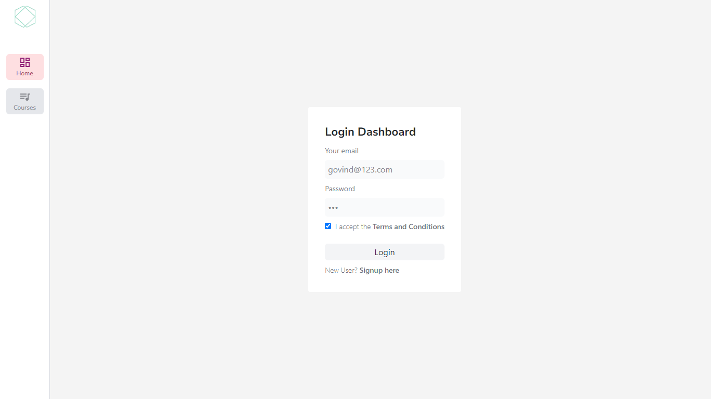
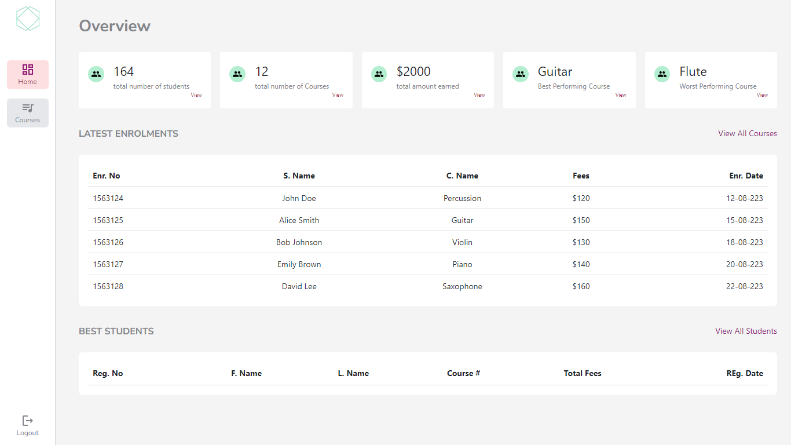
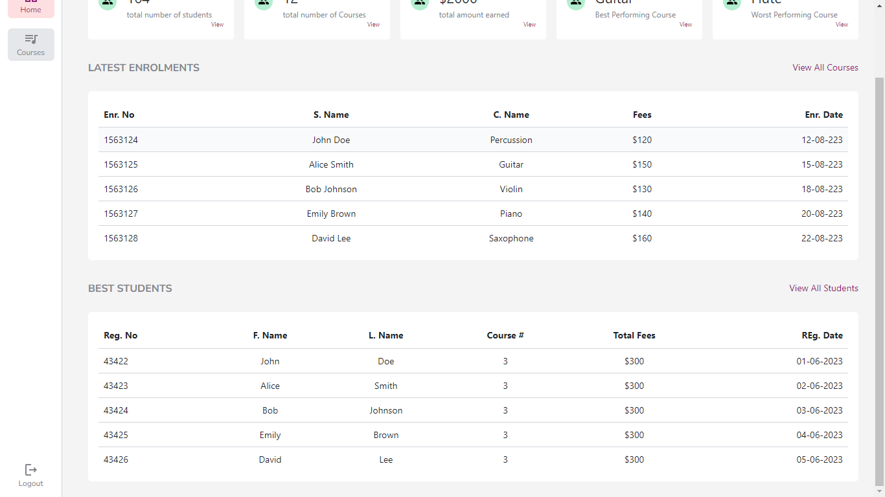
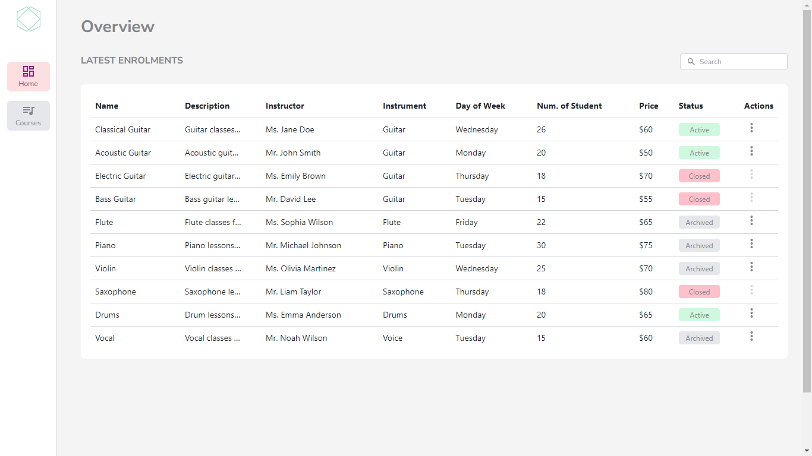
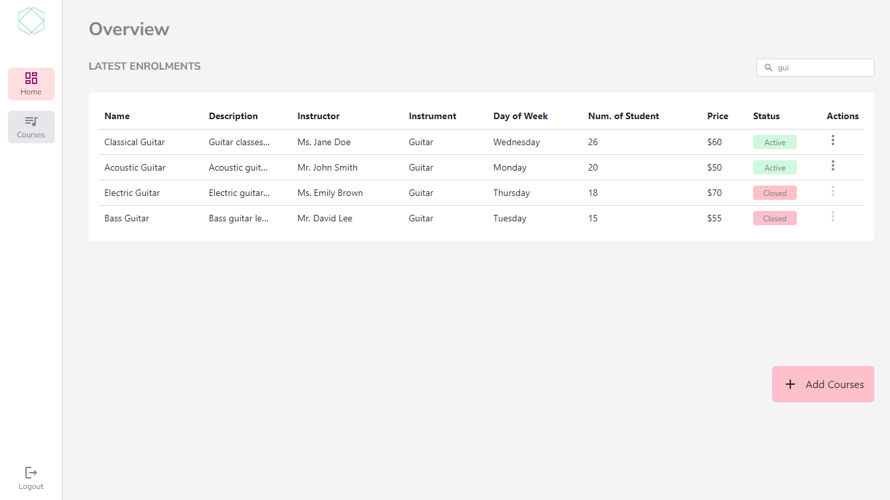
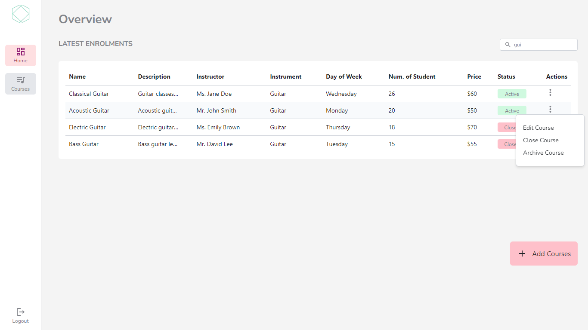

Copy code

# OCTALOGIC-TECH-ASSIGNMENT

A small music course learning student management frontend project.

## Table of Contents

- [Getting Started](#getting-started)
  - [Prerequisites](#prerequisites)
  - [Installation](#installation)
- [Screenshots](#Screenshots)

## Getting Started

### Prerequisites

- NPM
- JSON Server
- React.js
  - Redux
  - Tailwind CSS
  - React-Router
  - Axios

### Installation

1. Clone this repository:

- git clone https://github.com/gk072745/octalogic-tech-assignment.git
- Change into the project directory:

- cd octalogic-tech-assignment
  - Install project dependencies:
  - npm install

### Screenshots

